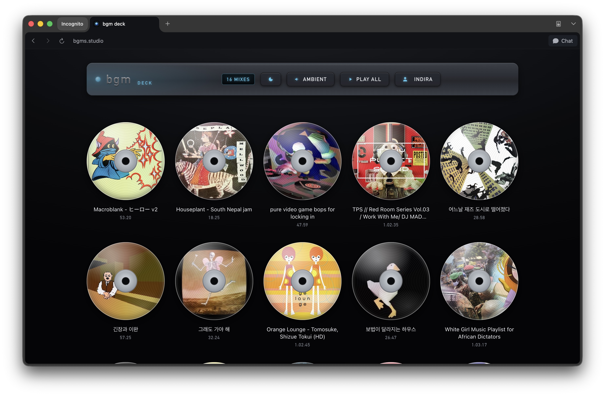

# bgm deck



A brushed-metal CD player for the web. It turns a public YouTube playlist into
spinning CDs you can play, with an inline ambient sound mixer, light/dark modes,
and listening-time tracking. Single static page — no build step, no backend.

Live at **https://bgms.studio**

## Features
- Live playlist via the YouTube Data API (falls back to a built-in list).
- CDs fly into a center-stage deck and spin while playing; pause freezes the angle.
- Progress bar with seek, and minimize-to-pill so you can browse while playing.
- "Most Played" rack backed by listening-time tracking.
- Optional account (Supabase) that syncs listening stats and a resume point
  across devices. Without it, everything still works and is saved on-device.
- Inline ambient mixer (Rain / Cafe / Fountain) with lit volume meters.
- Light and dark brushed-metal themes.
- Synthesized mechanical button sounds — no audio assets required.

## Run locally
The YouTube player needs a real `http://` origin, so serve the folder rather than
opening `index.html` directly:

```bash
cp config.example.js config.js   # then paste your keys into config.js
python3 -m http.server 8000       # open http://localhost:8000
```

### YouTube Data API key
1. In the Google Cloud Console, create a project and enable **YouTube Data API v3**.
2. Create an API key under Credentials.
3. Restrict it (Application restrictions → HTTP referrers) to the domains you serve
   from. Paste the key into `config.js`.

`config.js` is gitignored and never committed. Use `config.example.js` as the template.

### Optional: cross-device account (Supabase)
Leave the Supabase fields in `config.js` blank to skip this — the app runs fine
without it and saves stats on the device. To enable sync:

1. Create a free project at https://supabase.com.
2. In **Project Settings → API**, copy the **Project URL** and the **anon public**
   key into `config.js` (`SUPABASE_URL`, `SUPABASE_ANON_KEY`). The anon key is
   meant to be public.
3. In **Authentication → Providers**, enable **Email**. (Turn off "Confirm email"
   for the simplest sign-up flow, or leave it on to require confirmation.)
4. In the **SQL Editor**, run:

   ```sql
   create table if not exists bgm_stats (
     user_id uuid primary key references auth.users on delete cascade,
     stats jsonb default '{}'::jsonb,
     resume jsonb,
     updated_at timestamptz default now()
   );

   alter table bgm_stats enable row level security;

   create policy "own row - select" on bgm_stats
     for select using (auth.uid() = user_id);
   create policy "own row - upsert" on bgm_stats
     for insert with check (auth.uid() = user_id);
   create policy "own row - update" on bgm_stats
     for update using (auth.uid() = user_id);
   ```

   Row-level security ensures each user can only read/write their own row.

## Ambient audio
The mixer loads loop files from an `audio/` folder:
`audio/rain.mp3`, `audio/cafe.mp3`, `audio/ocean.wav` (Fountain).
Missing files show a hint and stay silent. Pixabay and CC0 Freesound have suitable loops.

## Files
- `index.html` — the app.
- `config.example.js` — config template; copy to `config.js` and add your keys.
- `audio/` — ambient loop files.
- `favicon.svg` — animated LED icon.
